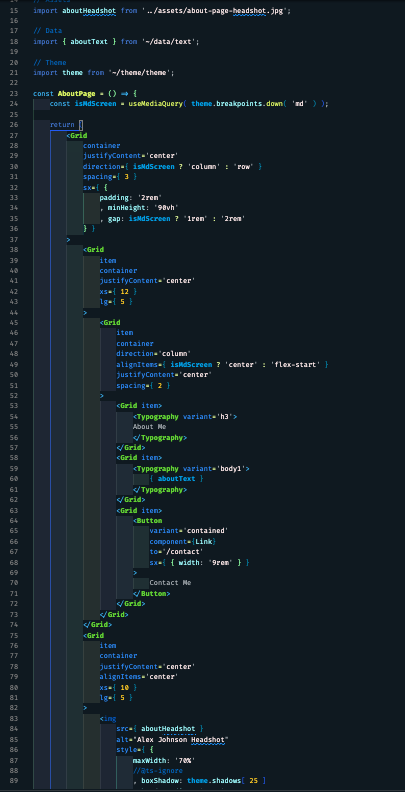
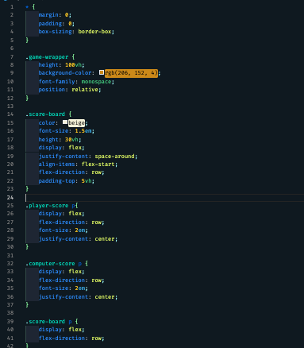

## Tungsten Carbide VS Code Theme

My first theme for VS Code! Had a blast building out the initial version of this color theme!

**NOTES: 

- This theme is currently in Beta and will be updated frequently. Please be sure to update this extension as updates are available and reload your VS code window!
- At the current moment, this theme is optimized for standard JS/CSS/HTML & React/TypeScript. Other languages will work - but please be aware that they have not been fully optimized yet and the colors may not be the same as you see in the screenshots. 

## Screenshots

### React/TypeScript

### JavaScript
 

### CSS
 

### HTML/Markup

